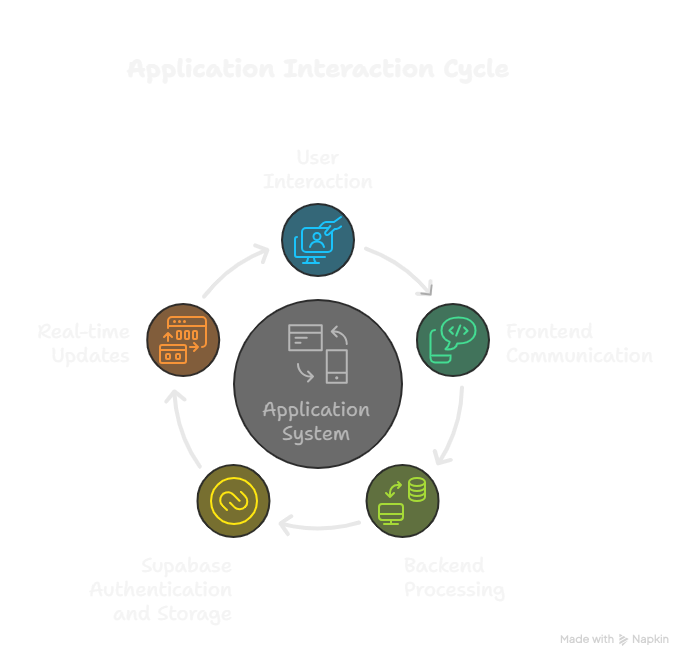

 # Task Management App (Hackathon Project by [Katomaran](https://www.katomaran.com))

## Project Overview
This is a full-stack Task Management Web Application built for a hackathon run by [Katomaran](https://www.katomaran.com). The app allows users to manage tasks, share them, and collaborate in real-time with social login (Google OAuth). It features a modern, responsive UI with glassmorphism and gradient effects.

---

## Tech Stack
- **Frontend:** React, Tailwind CSS, Vercel (hosting)
- **Backend:** Node.js, Express, Railway (hosting)
- **Database & Auth:** Supabase (Postgres, Auth, RLS)
- **Real-time:** WebSocket (for instant task updates)
- **OAuth:** Google (via Supabase Auth)

---

## Architecture Flow

---

## Demo Video
[Loom Video Walkthrough](https://www.loom.com/share/0360ebed6a7a4b6c8843452f7e221263?sid=fd0ab3fc-b50c-48de-995d-84920b9278a2)

---

## Setup & Deployment

### Local Development
1. Clone the repo and install dependencies in both `frontend` and `backend`.
2. Set up `.env` files for both frontend and backend with your Supabase and API credentials.
3. Run backend (`npm start` in `/backend`) and frontend (`npm start` in `/frontend`).

### Cloud Deployment
- **Frontend:** Deploy `/frontend` to Vercel. Set environment variables in Vercel dashboard.
- **Backend:** Deploy `/backend` to Railway. Set environment variables in Railway dashboard.
- **Supabase:** Configure Auth, Database, and Redirect URLs for both local and production.

---

## Credits
This project is a part of a hackathon run by [Katomaran](https://www.katomaran.com).
